<div align="center">



</div>

---

## Quick Start

```bash
git clone https://github.com/roshaldsouza/ai-voice-interview-coach
npm install

# Get free key → console.groq.com (no credit card)
echo "REACT_APP_GROQ_API_KEY=gsk_..." > .env

npm start  # Chrome or Edge required
```

---

## How It Works

```
🎯 Pick Set  →  🎙 Speak  →  🤖 AI Scores  →  📊 Improve
```

Your answer is transcribed live via **Web Speech API**, then sent to **Llama 3.3-70b via Groq** which returns structured scores + a rewritten better answer — in under 2 seconds.

```json
{
  "score": 8,  "relevance": 9,  "clarity": 7,  "confidence": 8,
  "strengths":    ["Quantified impact (70%)", "Technical depth"],
  "improvements": ["Add team context", "Mention business impact"],
  "betterAnswer": "I led a performance optimization that reduced..."
}
```

---

## Features

| | |
|---|---|
| 🎙 **Voice Recording** | Web Speech API — zero install, zero cost |
| 🤖 **AI Scoring** | Llama 3 via Groq free tier, ~1s response |
| 📊 **Score Rings** | Animated SVG — Clarity, Relevance, Confidence |
| 🚫 **Filler Detection** | Tracks "um", "uh", "like", "basically"... |
| 📈 **Dashboard** | Streak tracker, score trends, session history |
| 📄 **PDF Export** | Full session report, no backend needed |
| 🎯 **Question Sets** | Frontend · Behavioral · System Design · Custom |
| 💾 **localStorage** | History persists locally, zero server |

---

## Stack

`React 18` · `Groq API` · `Llama 3.3-70b` · `Web Speech API` · `jsPDF` · `localStorage` · `Vercel`

---

## Roadmap

- [x] Voice recording + live transcript
- [x] Groq AI scoring — 4 dimensions
- [x] Progress dashboard + streak tracker
- [x] PDF export report
- [x] Custom question sets builder
- [ ] TTS playback for better answers
- [ ] Shareable result card
- [ ] Company-specific question packs

---

<div align="center">

built by [roshaldsouza](https://github.com/roshaldsouza) · MIT · ⭐ if it helped you land a job

</div>
